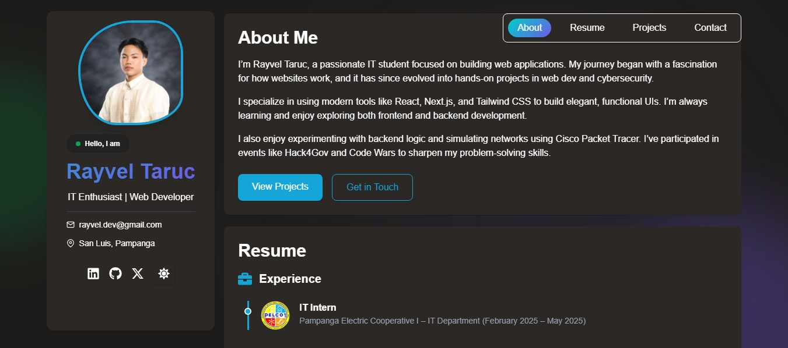

# 💼 Rayvel Taruc — Developer Portfolio

Welcome to my personal developer portfolio!  
Built with Next.js, Tailwind CSS, and TypeScript, this project showcases my skills, experience, and projects as a developer and IT student.

---

## 🚀 Live Demo

- 🔗 [GitHub Pages](https://just-rayvel-taruc01.github.io/)
- 🔗 [Vercel Deployment](https://just-rayvel-taruc01-github-io.vercel.app/)

---

## 📸 Preview

 <!-- Replace with your actual screenshot if available -->

---

## 🛠 Tech Stack

- Framework: [Next.js](https://nextjs.org/)
- Styling: [Tailwind CSS](https://tailwindcss.com/)
- Language: TypeScript
- Forms: [Formspree](https://formspree.io/)
- Icons: [React Icons](https://react-icons.github.io/react-icons/)
- Animation: [canvas-confetti](https://www.npmjs.com/package/canvas-confetti)
- Deployment: GitHub Pages & Vercel

---

## 📂 Folder Structure

```
just-rayvel-taruc01.github.io/
├── public/                        # Static assets (images, logo, certificates, preview)
│   ├── preview.jpg
│   ├── profile.JPG
│   ├── certificate/
│   ├── images/
│   └── logo/
├── src/
│   ├── app/                       # Next.js app directory (routing, global styles, layout)
│   │   ├── favicon.ico
│   │   ├── globals.css
│   │   ├── layout.tsx
│   │   ├── page.tsx
│   │   ├── hooks/
│   │   │   └── useDarkMode.ts
│   │   └── lib/
│   │       ├── theme-provider.tsx
│   │       └── theme-script.tsx
│   │       └── utils/
│   │           └── githubApi.tsx
│   ├── components/                # Reusable UI and page section components
│   │   ├── Navigation.tsx
│   │   ├── SideBar.tsx
│   │   ├── sections/
│   │   │   ├── about/
│   │   │   │   └── About.tsx
│   │   │   ├── contact/
│   │   │   │   ├── Contact.tsx
│   │   │   │   ├── ContactForm.tsx
│   │   │   │   └── ContactFormWrapper.tsx
│   │   │   ├── projects/
│   │   │   │   └── Projects.tsx
│   │   │   ├── resume/
│   │   │   │   └── Resume.tsx
│   │   └── ui/
│   │       ├── DarkModeToggle.tsx
│   │       ├── Modal.tsx
│   │       └── Skills.tsx
├── eslint.config.mjs
├── next-env.d.ts
├── next.config.ts
├── package.json
├── postcss.config.js
├── postcss.config.mjs
├── README.md
├── tailwind.config.js
├── tsconfig.json
```

---

## 🧪 Features

- Light/Dark theme toggle (custom variables)
- Scroll-synced navigation with active link highlight
- Contact form with validation, confetti, and modal
- Responsive layout and card-based design
- Deployed to both GitHub Pages & Vercel

---

## 📥 Getting Started

```bash
# Clone the repo
git clone https://github.com/just-Rayvel-Taruc01/just-Rayvel-Taruc01.github.io.git

# Navigate into the project folder
cd just-Rayvel-Taruc01.github.io

# Install dependencies
npm install

# Run the development server
npm run dev
```

---

## 📄 License

This project is open-source and free to use for educational and portfolio purposes.

---

## 🙋‍♂️ Contact

Feel free to reach out via the contact form on the website or email me directly at  
📧 rayvel.dev@gmail.com

---

_Designed & built by Rayvel Taruc_
